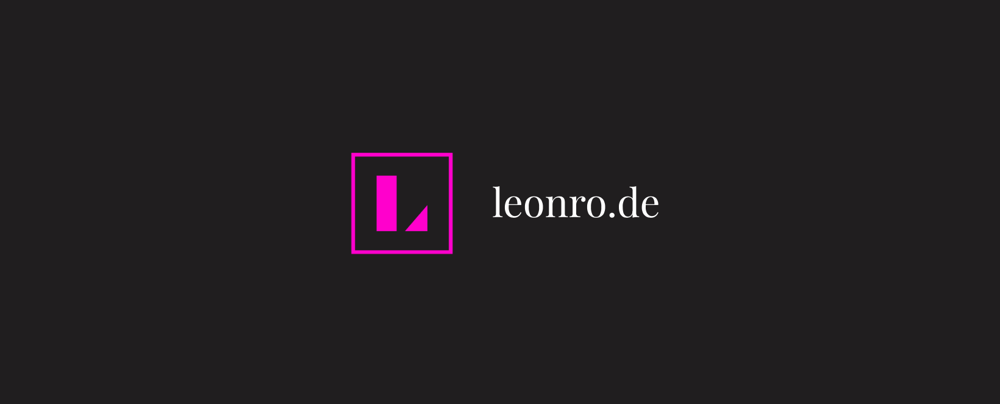

### 👋 Hi there!

I'm Leon, a high-school student who loves developing all kinds of software.

🔎 [leonro.de](https://leonro.de)

⚡ Using React.js, Next.js, JavaScript, Python, and Node.js to power my projects  
⚡ Open to project collaboration  
⚡ Building the website of your dreams  

### Notable Projects 
⚡ [mazzle (in development)](https://mazzle.vercel.app)  
⚡ [westchestercovidtracker.com](https://westchestercovidtracker.com)  
⚡ [better-joystick](https://github.com/leonrode/better-joystick)  
